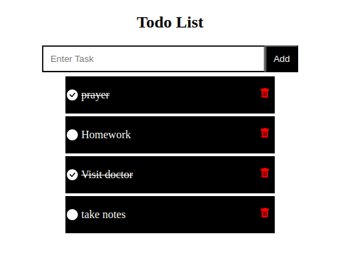

# ToDo List Application



A simple ToDo list application built with React for the frontend and Node.js/Express with MongoDB for the backend.

## Run

in the todolist directory

```bash
 npm run dev
```

in the Server directory

```bash
 npm start
```

## installation

in the root directory TODOLIST -> npm create vite@latest
select react
select javascript
then in the directory todolist

```bash
npm install
npm install axios react-icons
npm run dev
```

then in the directory Server

```bash
npm init -y
npm install express mongoose cors
npm install nodemon(for compass)
```

## connect atlas

1. ctrl+shift+p insert the .env string
2. the string should contain the db name if u want to create it while running.
3. node index.js
4. Every time you add a port restart the server
